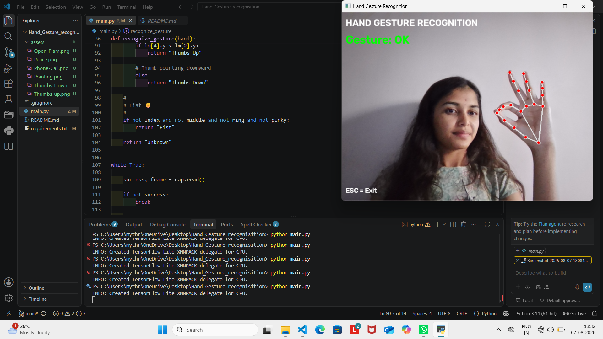
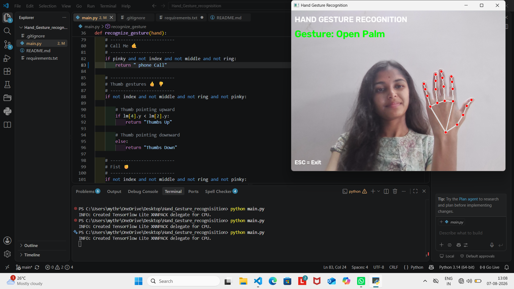
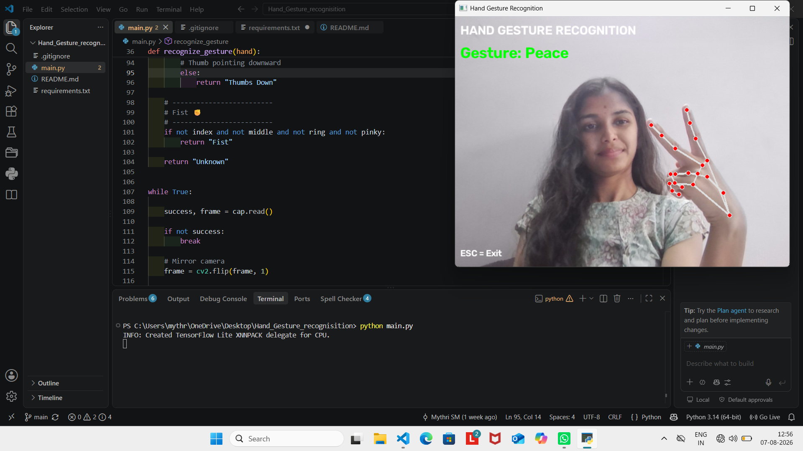
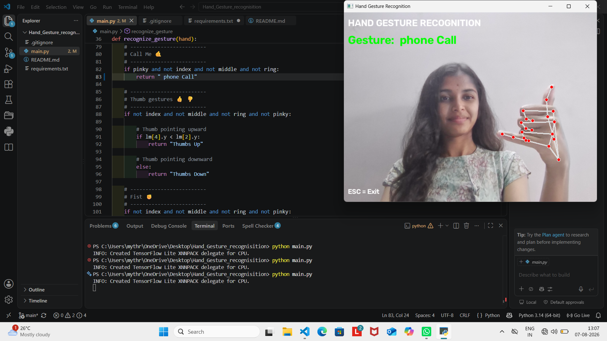
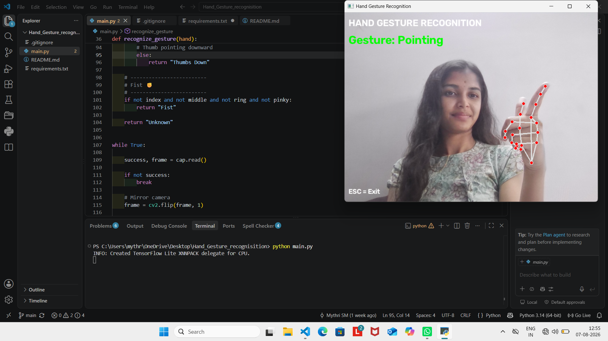
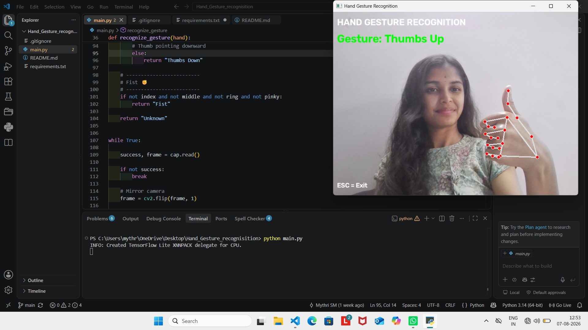
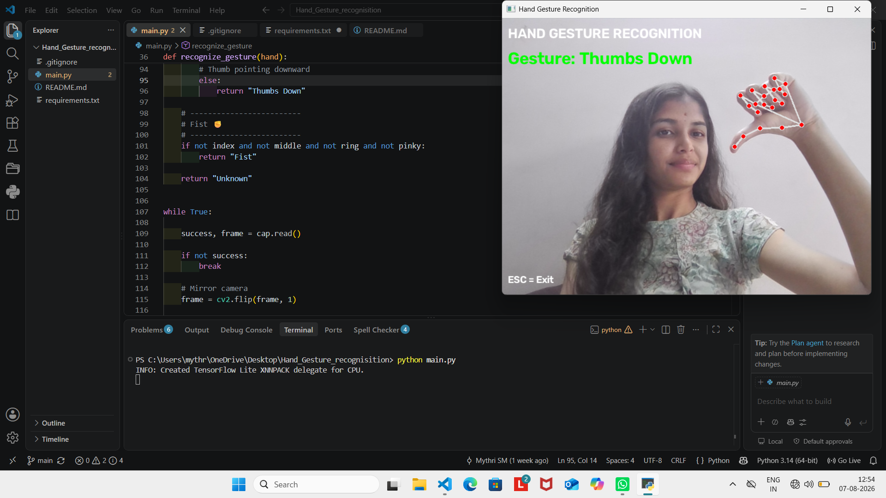

# 🖐️ Hand Gesture Recognition System

**Author:** Mythri SM

A real-time computer vision application that detects and recognizes different hand gestures using a webcam. The system uses **MediaPipe** for hand landmark detection and **OpenCV** for video processing and real-time gesture recognition.

---

## ✨ Features

- 📷 Real-time webcam-based hand detection
- ✋ Hand landmark tracking using MediaPipe
- 🎯 Real-time gesture recognition
- ⚡ Smooth gesture detection
- 🖥️ Live display of recognized gestures
- 👆 Supports multiple predefined hand gestures

---

## 🛠️ Technologies Used

- Python
- OpenCV
- MediaPipe

---

## 📂 Project Structure

```text
Hand_Gesture_Recognition/
│── main.py
│── requirements.txt
│── README.md
│── assets/
│   ├── ok.png
│   ├── Open-Palm.png
│   ├── Peace.png
│   ├── Phone-Call.png
│   ├── Pointing.png
│   ├── Thumbs-Up.png
│   └── Thumbs-Down.png
│── .gitignore
```

---

## 📸 Screenshot

### 1. 👌 OK Gesture



### 2. 🖐️ Open Palm Gesture



### 3. ✌️ Peace Gesture



### 4. 🤙 Phone Call Gesture



### 5. ☝️ Pointing Gesture



### 6. 👍 Thumbs Up Gesture



### 7. 👎 Thumbs Down Gesture



---

## ⚙️ Installation

### 1. Clone the repository

```bash
git clone https://github.com/MythriSM/Hand_Gesture_Recognition.git
```

### 2. Navigate to the project directory

```bash
cd Hand_Gesture_Recognition
```

### 3. Install the required dependencies

```bash
pip install -r requirements.txt
```

### 4. Run the application

```bash
python main.py
```

---

## 🎮 Supported Gestures

| Gesture | Recognition |
|---------|-------------|
| 👌 | OK |
| 🖐️ | Open Palm |
| ✌️ | Peace |
| ☝️ | Pointing |
| 🤙 | Phone Call |
| 👍 | Thumbs Up |
| 👎 | Thumbs Down |
| ✊ | Fist |

---

## 💡 How It Works

1. The webcam captures live video.
2. MediaPipe detects the hand and its landmarks.
3. The system analyzes finger positions and thumb-index distance.
4. Predefined gestures are identified.
5. The recognized gesture is displayed on the screen.
6. Recent detections are used to smooth the output.

---

## 📌 Requirements

- Python 3.x
- OpenCV
- MediaPipe
- Working Webcam

---

## 🚀 Future Enhancements

- Add more hand gestures
- Support multiple hands
- Improve recognition accuracy
- Add gesture-based application controls
- Add voice and gesture interaction

---

## 👨‍💻 Author

**Mythri SM**

Computer Science Engineering Student

Interested in:
- 💻 Software Development
- 🌐 Web Development
- 🤖 AI & Computer Vision

---

## 📄 License

This project is intended for educational and portfolio purposes.